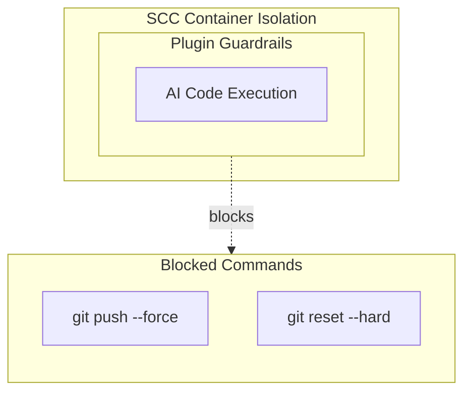

# Sandboxed Code Plugins

Curated plugins for safer AI-assisted development with Claude Code.

## Overview

This marketplace provides plugins that enhance safety, productivity, and control
when using AI coding assistants. These plugins work standalone but are designed
to complement [SCC (Sandboxed Code CLI)](https://github.com/CCimen/scc)
for defense-in-depth protection.

## Quick Start

### Option 1: With SCC (Recommended)

Add to your SCC org config:

```json
{
  "marketplaces": {
    "sandboxed-code-official": {
      "source": "github",
      "owner": "CCimen",
      "repo": "sandboxed-code-plugins"
    }
  },
  "defaults": {
    "enabled_plugins": ["scc-safety-net@sandboxed-code-official"]
  }
}
```

### Option 2: Standalone Claude Code

Add marketplace and enable plugin in `.claude/settings.json`:

```json
{
  "extraKnownMarketplaces": {
    "sandboxed-code-official": {
      "source": {
        "source": "github",
        "repo": "CCimen/sandboxed-code-plugins"
      }
    }
  },
  "enabledPlugins": ["scc-safety-net@sandboxed-code-official"]
}
```

> **Note:** This format matches SCC's adapter implementation. If Claude Code updates its settings format, check the [Plugin settings docs](https://docs.anthropic.com/en/settings#plugin-settings).

Or install via CLI:
```bash
# Step 1: Add the marketplace
/plugin marketplace add CCimen/sandboxed-code-plugins

# Step 2: Check the marketplace key assigned
/plugin marketplace list

# Step 3: Install plugin using the key from step 2
/plugin install scc-safety-net@<marketplace-key>
```

> **Note:** The marketplace key is typically `owner-repo` format (e.g., `CCimen-sandboxed-code-plugins`), but always verify with step 2.

## Available Plugins

| Plugin | Description | Status |
|--------|-------------|--------|
| [scc-safety-net](./scc-safety-net/) | Blocks destructive git commands | Stable |
| [scc-wizard](./scc-wizard/) | Interactive wizard for creating, editing, and validating SCC configs | Stable |

> Version info: See each plugin's `.claude-plugin/plugin.json` for current version.

## Terminology Quick Reference

| Context | Key/Format | Example |
|---------|------------|---------|
| SCC org `defaults` | `enabled_plugins` | `["scc-safety-net@sandboxed-code-official"]` |
| SCC org `profiles.X` | `additional_plugins` | `["extra-plugin@marketplace"]` |
| Claude Code settings | `enabledPlugins` | `["scc-safety-net@sandboxed-code-official"]` |
| CLI install | `plugin@<key>` | Run `/plugin marketplace list` first to get key |

## Defense in Depth



**SCC provides**: Container isolation, org-level config, policy management

**Plugins provide**: Behavioral guardrails, command interception, safety enforcement

## License

MIT
